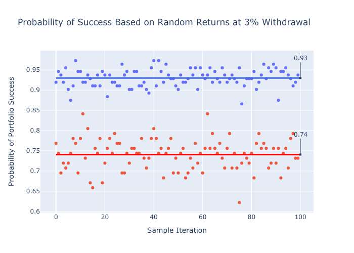

# Long-Haul Retirement

## Introduction

How much should you save for retirement? In an age of dwindling pensions and an unstable Social Security system, this question has gained more attention. Studies attempting to answer this question have been conducted in recent history by asking the inverse question--how much can you safely withdraw from your retirement portfolio each year and not deplete your funds? These studies have been conducted using 20th century investment returns and assuming some fixed portfolio asset allocation in order to determine a safe withdrawal rate (SWR). It was concluded that 4% is a reasonable SWR since the probability of portfolio success, based on historical analysis, is 95%.

As people live longer and try to retire earlier, it would be helpful to examine retirement planning over a longer time horizon. What is the probability of a retirement portfolio lasting 40, 50 or 60 years instead of 30 years at a 4% withdrawal rate? Would a lower withdrawal rate increase the probability of portfolio success significantly? Since historical market returns are not a guarantee of future market returns, what would happen if we randomized returns? Would the probability of portfolio success change significantly?

### Assumptions:
1. Brokerage fees and taxes are not considered (i.e. they should be paid from withdrawn funds).
2. Inflation is based on changes in CPI.
3. Asset allocation of 50/50 stocks(S&P 500) to bonds (long-term government bonds) is maintained year to year.
4. A single withdrawal is made on Jan. 1 each year to cover expenses for the year ahead. Yearly gains/losses on the remaining balance are calculated on Dec. 31 that year.

## Data

The data represents S&P 500 returns, S&P 500 dividends, long-term government bond yields and inflation for the years 1871-2012. An initial retirement portfolio of $100,000 was assumed in calculating ending portfolio balances for every rolling retirement period in the interval 1871-2012. The actual beginning balance is an arbitrary amount greater than zero since the calculations are based on rates. Ending balances were calculated and plotted for a 30-year retirement and a 60-year retirement for comparison value of the two extremes. The probability of porfolio success was calculated based on the percentage of the rolling retirement periods that had an ending portfolio balance greater than zero. Probabilities were calculated and plotted for 30-year, 40-year, 50-year and 60-year retirement periods at withdrawal rates ranging from 0% to 10%.

Annual market data was obtained from http://www.econ.yale.edu/~shiller/data.htm.

Randomized stock market returns were generated for the same historical time period (1871-2012) based on frequency of returns in historical data. 

Year-to-year valuations were calculated from the initial real-world stock price in 1871. The probability of portfolio success was calculated and plotted for 100 randomly generated datasets using a 30-year time horizon and a 60-year time horizon at a 3% withdrawal rate and a 4% withdrawal rate.

## Results

The ending portfolio balance displays a drastically greater range of values over a longer time horizon.

Based on historical data, length of retirement has little effect on the probability of success for withdrawal rates up to 4%. In fact, historical data reflects greater probability of success at 4% over a 60-year time horizon. For withdrawal rates greater than 4%, time periods greater than 30 years have lower probability of success until a 10% withdrawal rate. There seems to be little difference in the probabilities between 40, 50 and 60 years.

Randomized market returns appear to have a significantly lower probability of success for a 4% withdrawal rate over both time horizons. A 30-year retirement portfolio would have a 78% chance of success while a 60-year retirement portfolio would have a 57% chance of success. These probabilities increase to 93% and 74%, respectively, if the withdrawal rate is decreased to 3%.

Based on these results, the more risk-averse retiree would institute an initial withdrawal rate of 3% or less (i.e. save 34 times their annual expenses) to account for any time horizon. More adaptable retirees would be able to use an initial withdrawal rate of 4% since success is still fairly probable.

## Future Study

With more time, the data could be explored more deeply. The randomization of market returns could be more sophisticated than the randomization method used here. It would also be helpful to look at the effect of changing asset allocation (e.g. 75/25 stocks/bonds), especially with the low interest rates in recent years. 